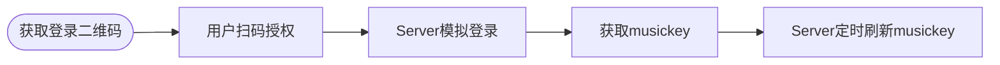

# 某音乐cookie长期有效解决方案

### 场景

获取到一个musickey之后用一段时间就会提示过期，将无法继续使用。

[jsososo](https://github.com/jsososo/QQMusicApi "jsososo")大佬的仓库暂无给出有效解决方案，只是从页面复制cookie的操作以此保持musickey持续有效。但是这种方式非常的繁琐，且频繁。

***

### 可行方案

我们不妨换一种解决方案，以此保持musickey持续有效。

方案我这已经跑通并验证过了，非常持续稳定。🔥

**大概流程如下：**

通过模拟登录的方式，可以实现和官方一样的效果(授权不过期)。

***

### 实现效果

我这实现的登录效果，拿到登录二维码之后，模拟登录流程即可。登录成功后再去换取musickey等参数即可。

***

### 一起讨论

联系我：<yufirem@vip.qq.com>
